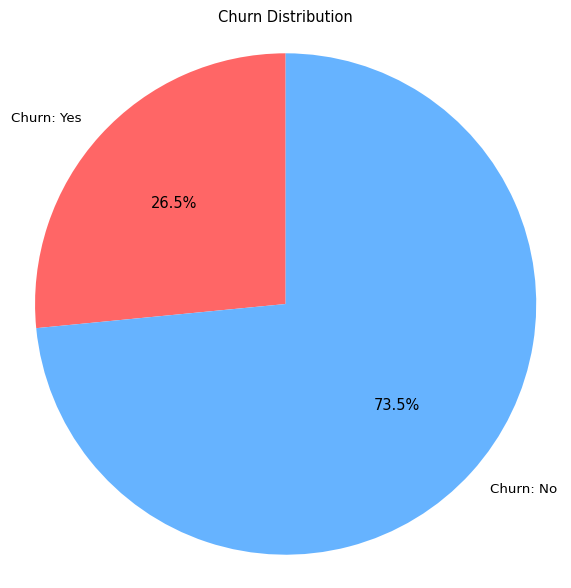
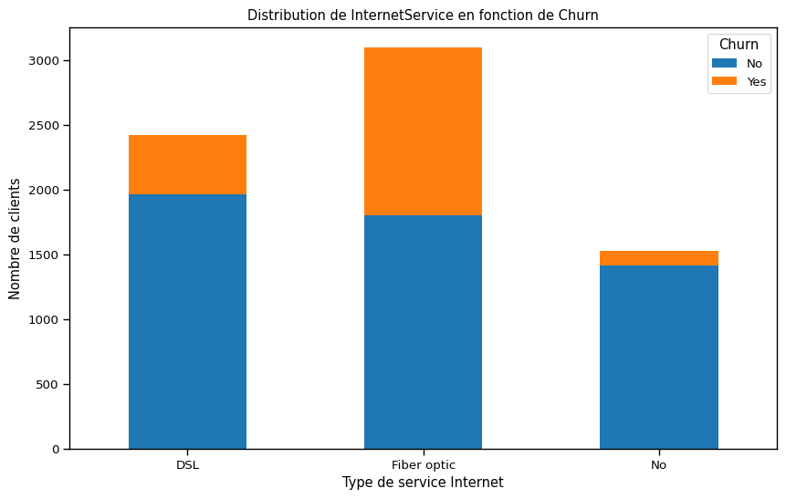
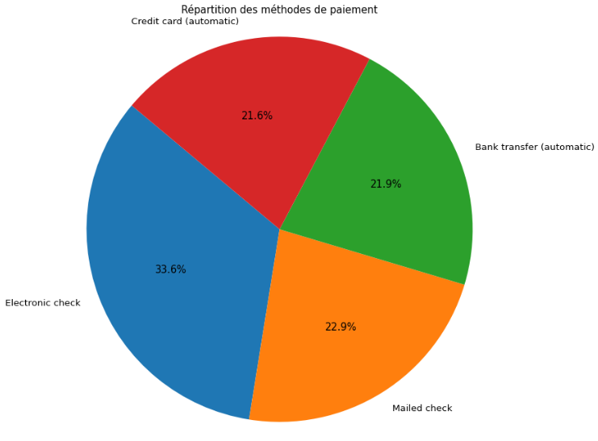
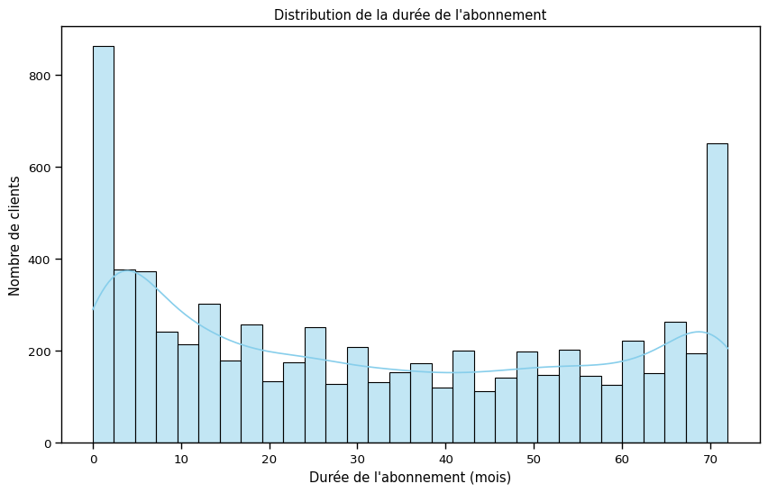
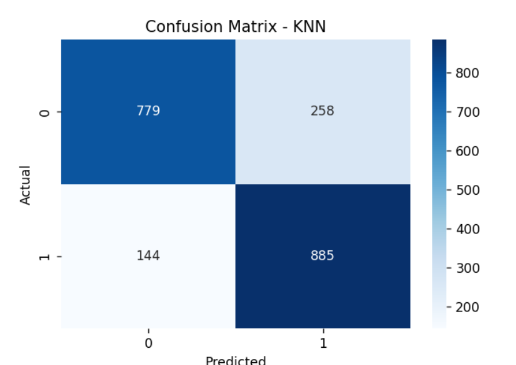

# 🚀 Churn Client-Enterprise

---

## 📌 Description du Projet

🔧 Gestion de bout en bout, incluant la sélection, l'analyse, et la visualisation des données. Ce projet prévoit la prédiction du Churn Client (désabonnement) pour les entreprises.

⚙️ Pré-traitement, gestion des valeurs aberrantes, et extraction des caractéristiques pertinentes.

📊 Développement de modèles de prédiction du churn client avec des résultats optimisés :

- **SVM** : 78%  
- **KNN** : 81%  
- **Gradient Boosting** : 80%  
- **TabNet Classifier** : 79%

---

## 🛠️ Fonctionnalités

- 🔍 Prétraitement des données (StandardScaler et encodage des variables catégorielles).  
- ❌ Gestion des valeurs manquantes.  
- 📈 Sur-échantillonnage avec **SMOTE**.  
- 🧠 Construction et entraînement de plusieurs modèles de classification.  
- 📉 Évaluation et comparaison des performances des modèles.  
- 🎨 Visualisation avec **Seaborn** et **Matplotlib**.

---

## 📂 Structure du Projet

```
Projet_Datamining/
│
├── Projet_datamining.ipynb # 📓 Notebook principal (exploration et modélisation)
├── deep.py                # 🧑‍💻 Script principal (modèle et prétraitement)
├── README.md              # 📄 Documentation du projet
|
├── images/                # 🖼️ Dossier contenant les images pour le README
│
└── results/               # 📁 Dossier pour stocker les résultats
```

---

## 🧰 Prérequis

- 🐍 Python 3.8 ou supérieur  

---

## 🚀 Installation et Exécution

📥 Cloner ce dépôt:
```bash
git clone https://github.com/dhia-69/Churn Client-Enterprise.git
```
📂 Accédez au dossier du projet :
```bash
cd Churn Client-Enterprise
```
▶️ Exécutez le script principal ou ouvrez le notebook :
```bash
python deep.py
# ou
jupyter notebook Projet_datamining.ipynb
```

---

## 📊 Résultats et Visualisations






### 📌 Matrice de Confusion de meilleur modéle



### 📋 Rapport de Classification

Un rapport détaillé s'affiche dans la console après l'entraînement du modèle, incluant la précision, le rappel et le score F1.

---

## ⚙️ Personnalisation

- ✏️ Vous pouvez modifier les colonnes utilisées pour l'entraînement dans le script `deep.py` (variables `categorical_cols` et `specific_cols`).  
- 📓 Le notebook `Projet_datamining.ipynb` permet de visualiser chaque étape du processus.

---

## 👥 Contributeurs

- **Dhia** et **Habib** – Développement et implémentation  
- 📧 Contact : dhiatoukebri@gmail.com / haboubkammoun13@gmail.com

---


